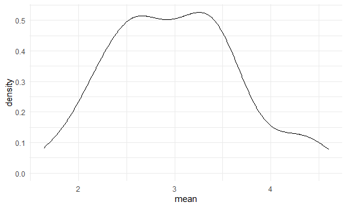
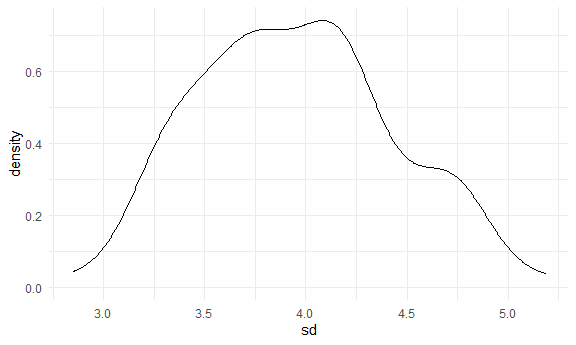

Simulations
================

## Let’s simulate something.

I have a function.

``` r
sim_mean_sd = function(samp_size, mu = 3, sigma = 4) {
  
  sim_data = 
    tibble(
      x = rnorm(n = samp_size, mean = mu, sd = sigma)
    )

  sim_data %>%
    summarize(
      mean = mean(x),
      sd = sd(x)
    )
  
}
```

I can “simulate” by running this line.

``` r
sim_mean_sd(30)
```

    ## # A tibble: 1 x 2
    ##    mean    sd
    ##   <dbl> <dbl>
    ## 1  2.26  4.40

## Let’s simulate a lot

Let’s start with a for loop

``` r
output = vector("list", length = 100)

for (i in 1:100) {
  
  output[[i]] = sim_mean_sd(samp_size = 30)
  
}

bind_rows(output)
```

    ## # A tibble: 100 x 2
    ##     mean    sd
    ##    <dbl> <dbl>
    ##  1  3.39  4.82
    ##  2  3.80  3.95
    ##  3  3.14  4.41
    ##  4  1.39  3.60
    ##  5  3.63  4.29
    ##  6  2.87  3.65
    ##  7  2.36  3.83
    ##  8  3.43  3.59
    ##  9  1.78  3.64
    ## 10  2.35  3.70
    ## # ... with 90 more rows

Let’s use a loop function

``` r
sim_results =
  rerun(100, sim_mean_sd(samp_size = 30)) %>%
  bind_rows()

sim_results
```

    ## # A tibble: 100 x 2
    ##     mean    sd
    ##    <dbl> <dbl>
    ##  1  4.23  3.43
    ##  2  4.14  4.41
    ##  3  2.16  3.92
    ##  4  2.43  3.50
    ##  5  3.30  5.18
    ##  6  2.66  3.71
    ##  7  2.58  3.79
    ##  8  3.26  4.01
    ##  9  3.33  4.29
    ## 10  2.58  3.52
    ## # ... with 90 more rows

Let’s look at results

``` r
sim_results %>%
  ggplot(aes(x = mean)) + geom_density()
```



``` r
sim_results %>%
  summarize(
    avg_samp_mean = mean(mean),
    sd_samp_mean = sd(mean)
  )
```

    ## # A tibble: 1 x 2
    ##   avg_samp_mean sd_samp_mean
    ##           <dbl>        <dbl>
    ## 1          3.00        0.666

``` r
sim_results %>%
  ggplot(aes(x = sd)) + geom_density()
```


